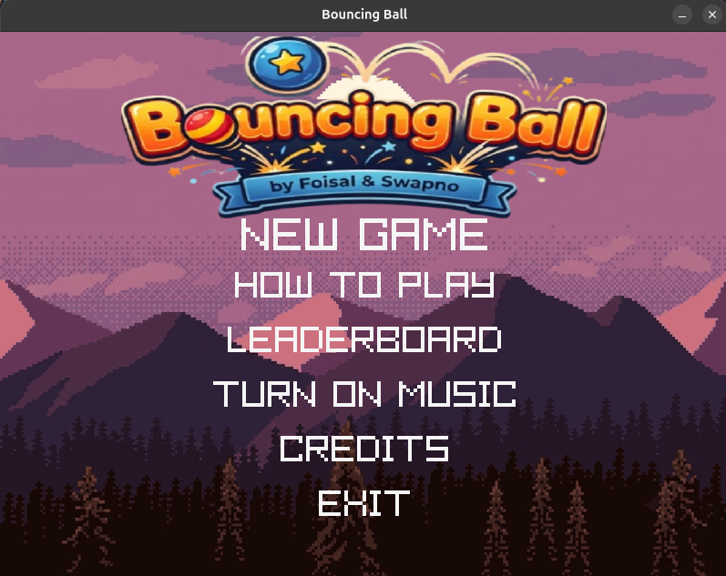
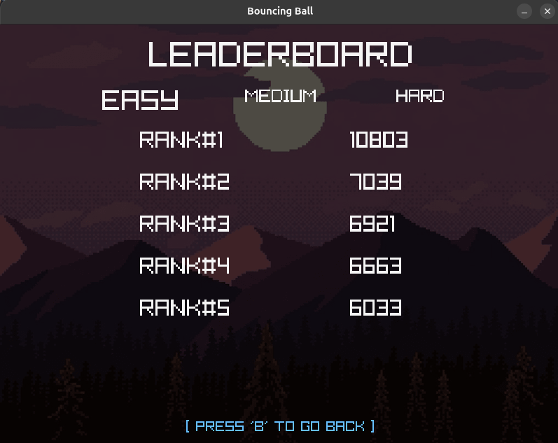
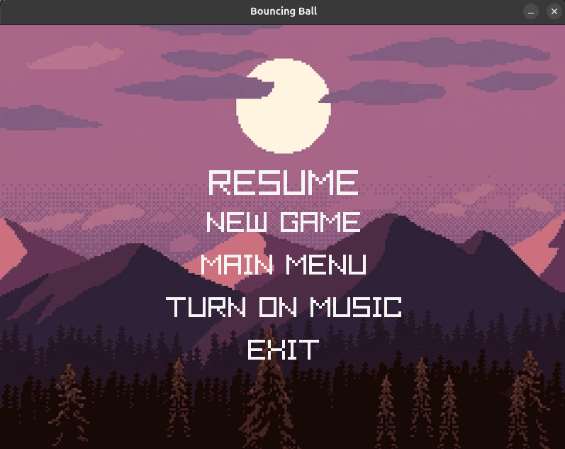
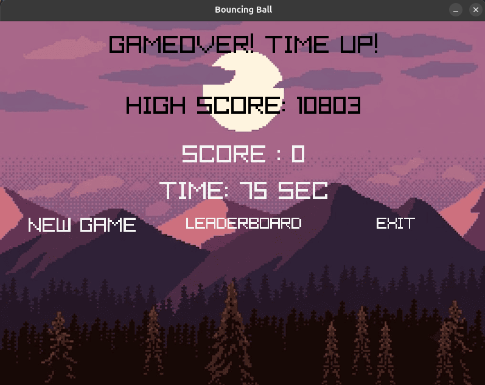
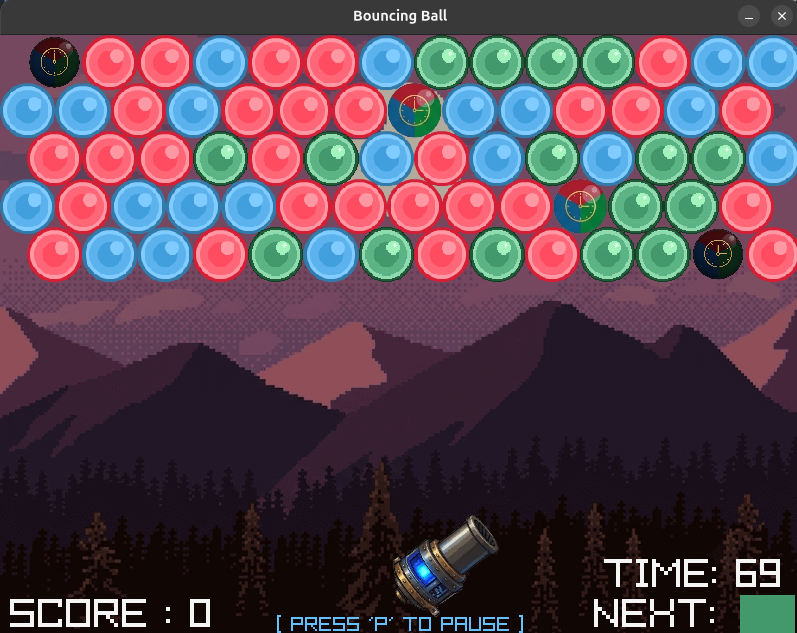

# Bouncing Ball

**Bouncing Ball** is a 2D arcade-style bubble shooter game built with the C programming language and the Raylib graphics library. The objective is to shoot colored balls from a rotating cannon to clear all matching balls on the grid before time runs out or the balls cross the danger line.

---

## Gameplay Demo & Screenshots

> **[Watch on YouTube](https://youtu.be/oBctFhi_xqM)** — See the gameplay mechanics and sound effects in action!

### Screenshots

| Main Menu | Gameplay |
| :---: | :---: |
|  |  |

| Pause Screen | Game Over |
| :---: | :---: |
|  |  |

| Leaderboard |
| :---: |
|  |

---

## Technical Specifications

- **Language:** C
- **Library:** [Raylib](https://www.raylib.com/) (Graphics & Audio)
- **Window Resolution:** 800 x 600 pixels
- **Target Frame Rate:** 60 FPS
- **Data Persistence:** Local file I/O for saving top 5 high scores across different difficulty levels (Easy, Medium, Hard)

---

## Game Rules & How to Play

### Objective
Clear the entire board of balls by aiming and shooting colored ammunition from your cannon to make matching groups.

### Gameplay Mechanics
1. **Match-3 Mechanics:** Connect **3 or more balls** of the same color to pop them and score points.
2. **Floating Balls:** Any floating balls disconnected below the matched group will automatically drop and vanish.
3. **Wall Bouncing & Roof Sticking:** Fired balls bounce off the left and right side walls, but stick immediately upon touching the top roof or existing balls.
4. **Special Timer Balls:**
   - **Red Timer Ball:** Hitting it rewards **+10 seconds** to your remaining time.
   - **Black Timer Ball:** Hitting it penalty-deducts **-10 seconds** from your remaining time.

### Game End Conditions
- **Time Up (Loss):** Running out of time results in a game over (`GAMEOVER! TIME UP!`). Your final score is halved as a penalty (`score = score / 2`).
- **Line Cross (Loss):** Allowing the balls to stack down and cross the lower danger line results in an instant loss (`GAMEOVER! YOU CROSSED THE LINE!`). Your final score is halved as a penalty (`score = score / 2`).
- **Victory (Win):** Clear all balls from the grid to win! Remaining time is converted into bonus points (`score += timeRemaining * 100`).

---

## Controls

| Input Method | Key / Action | Function |
| :--- | :--- | :--- |
| **Mouse Pointer** | Move Mouse | Aim the cannon angle |
| **Mouse Pointer** | Left Click / Hover | Navigate/click UI buttons or fire balls |
| **Keyboard** | **SPACE** / **Left Mouse Click** | Fire/Shoot ball from cannon |
| **Keyboard** | **UP / DOWN / LEFT / RIGHT** | Navigate menu options |
| **Keyboard** | **ENTER** | Confirm/Select menu item |
| **Keyboard** | **P** | Pause game / Open Pause Menu |
| **Keyboard** | **B** | Go back from How To Play, Leaderboard, or Credits pages |

---

## Audio & Sound Guide

Every gameplay action and event is paired with audio cues and music tracks:

### Background Music (BGM)
- **`menu.wav`**: Plays in the Main Menu, How To Play, Leaderboard, Level, and Credits screens.
- **`Gameplay_Resume.mp3`**: Plays during active gameplay and on the Pause/Resume screen.
- **`gameover.mp3`**: Plays on the Game Over screen after a win or loss.
- **`countdown.wav`**: Loops as an audio alert when remaining time falls to **10 seconds or lower**.

### Sound Effects (SFX)
- **`navigate.mp3`**: Triggers when navigating menu options using arrow keys or pressing navigation hotkeys.
- **`Click.mp3`**: Triggers when pressing `ENTER` or clicking to confirm a menu selection.
- **`blast.mp3`**: Plays upon firing a ball from the cannon.
- **`Bonus.wav`**: Plays when successfully hitting a **Red Timer Ball** (+10 sec).
- **`lostTime.wav`**: Plays when hitting a **Black Timer Ball** (-10 sec penalty).
- **`win.wav`**: Victory chime that plays upon clearing all balls from the board.
- **`gameover_instant.mp3`**: Plays instantly when the timer hits zero or balls cross the danger line.

---

## Credits & Attributions

### Visuals & Art
- **Background Image,Ball, Cannon & Logo:** Kenney.nl, OpenGameArt.org

### Audio & Music
- **Sound Effects (SFX):** OpenGameArt.org, Mixkit.co, Pixabay.com
- **Background Music:** OpenGameArt.org, Mixkit.co, Pixabay.com

---

## Supervisor

- **Md Zim Mim Siddiqee Sowdha**  
  Lecturer, Department of Computer Science and Engineering (CSE), BUET

---

## Team Members

- **Md. Foisal** - [@Foisal1301](https://github.com/Foisal1301)
- **Shahariar Sajid Swapno** - [@SajidSwapno](https://github.com/SajidSwapno)

---

## Build & Run

### Prerequisites
Make sure **Raylib** and a **GCC Compiler** are installed on your environment.

### Compilation
Run the following command in your terminal:

```bash
gcc main.c -o bouncing_ball -lraylib -lGL -lm -lpthread -ldl -lrt -lX11s